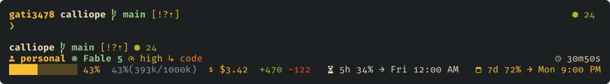

# preen



Below the prompt is Claude Code's statusline, and one line of shell makes it
yours. It is [`prompt/`](prompt/README.md), one piece of preen: a macOS
terminal and editor setup — kitty, zsh, tmux, Zed, Sublime Text — that checks
itself against your live config. _Preen_: to groom to your own standard.

## Take one piece

[`prompt/`](prompt/README.md) is the Claude Code statusline, drawn by cship.
The first block prints the plan and writes nothing; the second installs. With
[cship](https://github.com/stephenleo/cship) 1.8.2 or newer, both first ask
whether to take `starship.toml` too and what to call your account; without
it, the dry run says how to get it, and the install stops before any write.

```sh
curl -fsSL https://raw.githubusercontent.com/gati3478/preen/main/prompt/install.sh | bash -s -- --dry-run
```

```sh
curl -fsSL https://raw.githubusercontent.com/gati3478/preen/main/prompt/install.sh | bash
```

The terminal, [`terminal/kitty/`](terminal/kitty/README.md), the same way:

```sh
curl -fsSL https://raw.githubusercontent.com/gati3478/preen/main/terminal/kitty/install.sh | bash -s -- --dry-run
```

```sh
curl -fsSL https://raw.githubusercontent.com/gati3478/preen/main/terminal/kitty/install.sh | bash
```

The shell, [`shell/`](shell/README.md), the same way:

```sh
curl -fsSL https://raw.githubusercontent.com/gati3478/preen/main/shell/install.sh | bash -s -- --dry-run
```

```sh
curl -fsSL https://raw.githubusercontent.com/gati3478/preen/main/shell/install.sh | bash
```

The multiplexer, [`terminal/tmux/`](terminal/tmux/README.md), the same way:

```sh
curl -fsSL https://raw.githubusercontent.com/gati3478/preen/main/terminal/tmux/install.sh | bash -s -- --dry-run
```

```sh
curl -fsSL https://raw.githubusercontent.com/gati3478/preen/main/terminal/tmux/install.sh | bash
```

Each installer prints its plan and makes every refusal before its first
write, then copies its files into your config — copies, never symlinks, a
file of yours it replaces backed up beside it. The statusline's installer
merges its `statusLine` key into `~/.claude/settings.json`; kitty's appends
one `include` line to `~/.config/kitty/kitty.conf`; the shell's appends one
line each to the zshenv and zshrc zsh reads — `~/.zshenv` and `~/.zshrc`
unless `ZDOTDIR` moves them — and to `~/.inputrc`; tmux's appends one line
to `~/.config/tmux/tmux.conf`, or to `~/.tmux.conf` where only that is there.
`--help` is each script's manual.

## Take the setup

On a Mac without Homebrew, install it first from [brew.sh](https://brew.sh);
it brings the Command Line Tools `git clone` needs. The first block clones
this repository and prints bootstrap's plan, which asks nothing and writes
nothing; the second runs bootstrap and reads the result back.

```sh
git clone https://github.com/gati3478/preen ~/preen
cd ~/preen && ./bin/bootstrap --dry-run
```

```sh
./bin/bootstrap
./bin/preen doctor
```

`bootstrap` names each missing tool, an optional one with what goes without
it, and asks before it goes on without one the setup needs. It asks your
name and email for git and sets them in `~/.gitconfig.local`, leaving the
rest of that file as it is; deploys every row of `manifest.tsv`; and writes
`~/.config/kitty/tab-title.conf`, which holds your home, the one path kitty's
config language cannot template. It ends by naming each overlay the shipped
files read and everything it set aside. The statusline is linked but not
wired: its installer, run from the clone, wires it.

Every refusal, bootstrap's or `preen apply`'s, comes before the first write,
and bootstrap never modifies your clone. What it finds in the way:

- a symlinked directory between `~` and a file it deploys, the layout stow
  leaves, is refused;
- a plain file of yours is kept beside itself as `<file>.unpreened.<stamp>`,
  `<stamp>` the run's date and time;
- a symlink is never written through: at a `link` row it is replaced and its
  old target printed, at a `copy` row it is moved aside;
- a plain `~/.gitconfig`, or a `~/.ssh/config` plain or linked, becomes the
  `.local` beside it, unless one is there or yours already names it; git
  reads that file last and ssh first, so every line of yours wins;
- your `~/.zshenv`, `~/.zprofile` and `~/.zshrc`, set aside as above, go
  unread: their lines belong in the `.local` beside each, which the shipped
  file sources — never the shell piece's line, which bootstrap names.

The shipped `ssh/config` names Proton Pass's agent socket for every host.
Keys on disk still sign; `IdentityAgent SSH_AUTH_SOCK` under `Host *` in
`config.local` keeps an agent of your own.

`preen doctor` reads every row back, then checks the tools, warning rather
than failing where one is absent. The author's preferences are asserted
against your live config only when asked (python 3.11 or newer), because
they are the author's:

```sh
~/preen/bin/preen doctor --taste
```

## What changes when you take the setup

Some of the author's choices are felt at once. The zsh rows hold for the
shell piece taken alone too; [its page](shell/README.md#what-changes) names
the exceptions. [tmux's page](terminal/tmux/README.md#what-changes) lists the
rest of its choices; they hold for the setup too. An undo line goes in an
overlay, where it wins over the shipped file: the one its row names, or else
its tool's — `~/.zshrc.local`, `~/.config/kitty/local.conf`,
`~/.config/tmux/local.conf`, `~/.gitconfig.local` or `~/.ssh/config.local`.

| Tool | What you notice | Undo |
| --- | --- | --- |
| zsh | `>` refuses to overwrite a file; `>\|` does (`NO_CLOBBER`) | `unsetopt NO_CLOBBER` |
| zsh | a mistyped command is offered a correction (`CORRECT`) | `unsetopt CORRECT` |
| zsh | `*` matches dotfiles (`GLOB_DOTS`) | `unsetopt GLOB_DOTS` |
| zsh | word motion stops at every character but a letter or digit (`WORDCHARS=''`) | zsh's default, `WORDCHARS='*?_-.[]~=/&;!#$%^(){}<>'` |
| zsh | Up and Down search history by what is typed before the cursor | `bindkey '^[[A' up-line-or-history`<br>`bindkey '^[[B' down-line-or-history`<br>`bindkey '^[OA' up-line-or-history`<br>`bindkey '^[OB' down-line-or-history` |
| zsh | `ls` is eza, whose flags are not all ls's: `ls -ltr` is an error | `unalias ls` |
| zsh | `$EDITOR` is `zed --wait` where `~/.zshenv` finds `zed` — on PATH, in Homebrew's bin or `/usr/local/bin` — else nano, and always nano over ssh | `export EDITOR=… VISUAL=…` in `~/.zshenv.local` |
| zsh | over ssh, where tmux is installed, a shell attaches to the tmux session `remote`, and leaving tmux ends the login | `unset SSH_CONNECTION` in `~/.zprofile.local`; tools that read it then see no ssh session |
| zsh | `~/.zprofile` carries the author's JetBrains Toolbox, SDKMAN, Playdate and Docker lines — PATH entries and a `PLAYDATE_SDK_PATH` export, harmless where those are absent — and Antigravity's, which puts `~/.local/bin` ahead of Homebrew. Where a JDK 21 is installed, `JAVA_HOME` is it | `unset PLAYDATE_SDK_PATH` in `~/.zprofile.local`; `path=("$HOMEBREW_PREFIX/bin" $path)` there puts Homebrew back ahead; for another JDK, `export JAVA_HOME=…` and `path=("$JAVA_HOME/bin" $path)` there, since JDK 21's `bin` is ahead of `/usr/bin` |
| kitty | the left Option key is Alt, so characters typed with Option take the right one (`macos_option_as_alt`) | `macos_option_as_alt no` |
| kitty | selecting text copies it, replacing the clipboard (`copy_on_select`) | `copy_on_select no` |
| kitty | cmd+q saves the session and the next launch restores it (`startup_session`); before the first save, kitty logs that it cannot read the file and opens its usual window | `startup_session none`<br>`map cmd+q quit` |
| tmux | the prefix is C-Space, and C-b does nothing | `set -g prefix C-b`<br>`bind -N "Send the prefix key" C-b send-prefix`<br>`unbind C-Space` |
| git | `git pull` rebases, and refuses while the working tree has local edits (`pull.rebase`) | `rebase = false` under `[pull]` |
| git | git pages through delta, side by side, or through less without it | `pager = less` under `[core]` |
| ssh | ssh asks Proton Pass's agent for every host (`IdentityAgent`) | `IdentityAgent SSH_AUTH_SOCK` under `Host *` |

## Updating

```sh
cd ~/preen && git pull --rebase --no-autostash && ./bin/preen apply
```

A `link` row reads the clone, so it changes the moment the clone does.
`preen apply` then deploys any new row and resets a `copy` row an application
has rewritten, keeping the rewrite beside it; `preen doctor` lists every such
backup.

A tool that edits `~/.zshrc` or `~/.gitconfig` edits the clone, because those
are links, and the pull then refuses and changes nothing, whatever your own
pull, rebase or merge settings say: that is what its flags are for.
`git -C ~/preen status --short` names the file and `git -C ~/preen diff`
shows the edit. Its lines belong in the `.local` overlay beside the live
file; `git -C ~/preen checkout -- <file>` then clears it, and the pull goes
through.

kitty's tab title does not follow the clone: bootstrap writes its line into
`~/.config/kitty/tab-title.conf`, which wins over `kitty.conf`, so a change
to it arrives with a re-run of `./bin/bootstrap`.

## Leaving

In this order:

1. `~/preen/bin/preen doctor` lists under backups each file set aside beside
   a deployed one.
2. If you wired the statusline from the clone, delete the `statusLine` entry
   from `~/.claude/settings.json`, and any backup of that file: it predates
   what Claude Code wrote since.
3. Remove the links: every `link` row of `manifest.tsv` points into `~/preen`.
4. Move each backup back in its place. Among a file's stamped backups the
   earliest is the original, what was there before anything here replaced
   the file, whichever wrote it — bootstrap, `preen apply`, or a piece's
   installer; the later ones are rewrites. One with no stamp,
   `<file>.unpreened` or a numbered `<file>.unpreened.1`, comes from an older
   `preen apply` or bootstrap, and its name says nothing about when: where a
   file has one beside stamped ones, look inside before choosing.
5. Remove each `copy` row's file that had no backup and that you did not have
   before.
6. Move `~/.gitconfig.local` to `~/.gitconfig` and `~/.ssh/config.local` to
   `~/.ssh/config` where no backup went back: once the links are gone,
   nothing reads them.
7. Remove `~/.config/kitty/tab-title.conf`, which is the setup's, and the
   clone.

If you ran `macos/apply.sh`, `sh` the `macos.unpreened.*.sh` it named, to put
back the settings it changed.

## What is here

```
prompt/            the Claude Code statusline; its own page and installer
terminal/kitty/    the terminal; its own page and installer
terminal/tmux/     tmux for SSH: true colour, mouse, a deep history, resurrect; its own page and installer
terminal/bat/      one line: bat in the terminal's palette
terminal/ncdu/     one line: ncdu in the terminal's palette
shell/             zsh, readline, hushlogin, atuin; its own page and installer
editor/zed/        settings, a keymap on a JetBrains base, tasks
editor/sublime/    settings, Terminus to match, a vendored light scheme
git/               gitconfig, the global ignore; identity asked for, never here
gh/                the CLI's own preferences
ripgrep/           flags: hidden in, .git out, smart case, clickable matches
mise/              the runtime manager's global pins
ssh/               an Include for your own config, then the agent line; no hosts
macos/             System Settings, run by hand: --dry-run lists each change, a run saves what it replaces
bin/               bootstrap, preen — apply and doctor — and what the doctor runs
lib/               install.sh, the half the installers share
manifest.tsv       the source's public rows: file → live path → link or copy → permissions, where set
preferences.toml   each preference's value and why, and the rows that check it
LICENSE            MIT
```

## The model

**One table drives install and verification.** `manifest.tsv` maps each file
here to its live path and says whether the row is a symlink or a copy.
`preen apply` installs from it; `preen doctor` checks against it. There is
no second list, so "installed" and "checked" read the same row.

**`link` or `copy`, decided by who writes the file.** Where an application only
reads its config, the live file is a symlink and the repo file _is_ the config.
Where the application rewrites its own config — Sublime, gh, kitty for its
theme file — the row is a copy, because a symlink would be replaced by a plain
file the first time it saved.

**A piece stands alone through the tool's own include.** kitty reads its
includes last-wins, so `terminal/kitty/` lands under a directory of its own
plus one `include` line in your `kitty.conf`, never an edit inside it; the
files kitty reads by name from its config root are copied only where you
have none. zsh's include is `source` and readline's `$include`, so `shell/`
lands the same way, one line appended to each of your files; tmux's is
`source-file`, so `terminal/tmux/` does too. A tool with one
file and no include — the statusline — is copied and tailored by its
installer. Nothing installed either way points back here.

**Themes are a family, not one scheme.** Gruvbox Dark Hard where code runs —
kitty, tmux, the statusline — and Gruvbox Light Hard where it is read — Zed,
Sublime; Fira Code throughout, the Nerd Font build in the terminal.
kitty's palette is its own included file, so a swap touches one file, and
the statusline's and kitty's pages each carry a palette table.

## Make it yours

Fork or clone, keep `manifest.tsv`'s format and the two verbs, `preen apply` and
`preen doctor`, replace the rows with your own files, and delete every directory
you do not want along with its rows. The checks in `bin/preen-doctor` probe the
tools the author runs; read them and cut what is not yours.

## Not here

These files are generated from a private repository and published as they
are, so no pull requests, please: open an issue instead.

What cannot ship stays in that repository: the IntelliJ IDEA tree (it names an
employer), the fonts, the Obsidian snippets, the real ssh hosts, the git
identity, each machine's overlays and its half of `preferences.toml`, the
personal scripts, the prose that argues every preference and the wiki around
it, and the tools that generate this mirror. Nothing here reads those, and
nothing breaks without them: `preen doctor --taste` says once that the prose
is absent, and carries on.

MIT.
